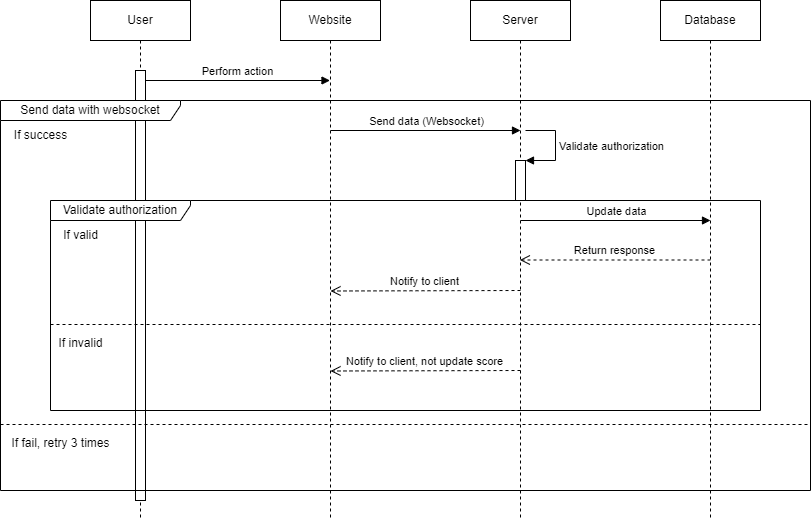

# Score Update Module Specification

## Table of Contents

1\. [Overview](#overview)

2\. [Flow of Execution](#flow-of-execution)

3\. [Software Requirements](#software-requirements)

4\. [Module Documentation](#module-documentation)

    - [API Endpoints](#api-endpoints)

    - [Request](#request)

    - [Response](#response)

    - [Error Handling](#error-handling)

    - [Authorization](#authorization)

5\. [Diagram](#diagram)

6\. [Improvement Suggestions](#improvement-suggestions)

---

## Overview

The Score Update Module is responsible for handling score updates on the website's scoreboard in real-time. It ensures that user actions trigger score updates while also preventing unauthorized access to the score updating functionality.

## Flow of Execution

1\. User performs an action on the website.

2\. This action triggers an API call to the application server with the relevant information.

3\. The Score Update Module processes the request, verifies the user's authorization, and updates the user's score.

4\. The updated score is then broadcasted to all connected clients to reflect the changes in real-time.

## Software Requirements

1\. The website must have a live scoreboard displaying the top 10 user scores.

2\. Real-time updates of the scoreboard are required.

3\. User actions trigger score updates.

4\. The action completion dispatches an API call to the application server for score update.

5\. Prevent unauthorized users from increasing scores.

## Module Documentation

### Web Socket

This event is used to update a user's score.

### Request

```json

{

  "userId": "string",

  "actionType": "string"

}

```

- `userId`: Unique identifier for the user.

- `actionType`: Type of action performed by the user.

### Response

```json

{

  "success": true,

  "message": "Score updated successfully",

  "newScore": 1000

}

```

- `success`: Indicates whether the score update was successful.

- `message`: Describes the result of the update.

- `newScore`: The updated score of the user.

### Error Handling

In case of an error, the API will respond with an appropriate error message along with a status code.

#### Example Error Response

```json

{

  "success": false,

  "message": "Unauthorized access",

  "error": {

    "code": 403,

    "details": "User is not authorized to update the score."

  }

}

```

### Authorization

Authorization is implemented using JSON Web Tokens (JWT). The server will generate a token upon successful user authentication. This token will be sent with every subsequent request to the `POST /api/score/update` endpoint in the `Authorization` header.

#### Example Token

```

Bearer eyJhbGciOiJIUzI1NiIsInR5cCI6IkpXVCJ9...

```

The server will verify the token's signature and expiration date. If the token is valid, the request will proceed. If the token is invalid or expired, the server will respond with a `403 Forbidden` error.

### Implementation Steps

1\. When a user logs in, generate a JWT token containing the user's ID and a secret key.

2\. Send this token to the client.

3\. The client includes this token in the `Authorization` header of subsequent requests.

4\. On the server, validate the token's signature and expiration date.

5\. If the token is valid, proceed with the score update; otherwise, return a `403 Forbidden` error.


## Diagram



## Improvement Suggestions

1\. Implement rate limiting to prevent abuse of the API.

2\. Add logging to track score updates and monitor for suspicious activity.

3\. Consider implementing a caching mechanism for improved performance in high-traffic scenarios.

4\. Provide detailed error messages to aid in debugging for frontend developers.

---

**Note:** For the actual implementation, ensure proper error handling, logging, and security measures are in place. This documentation serves as a guideline for the backend engineering team.